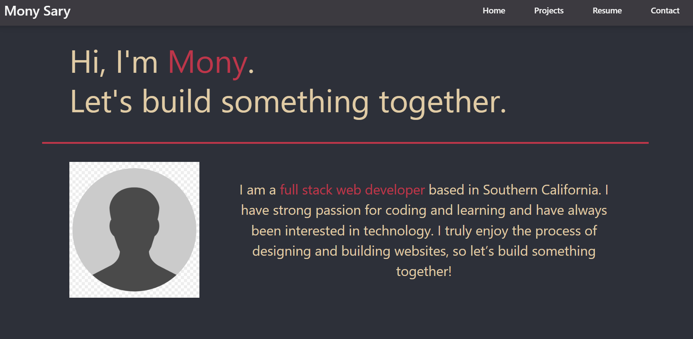

# React Developer Portfolio (in progess)

## Description
This portfolio website features a React built front end with multi-page rendering from a single page. The portfolio contains a homepage with a short about me paragraph, a projects pages, resume page, and contact page.

## Installation
The portfolio can be accessed at the following link: 

## Usage
Users can are presented with the about me page when first visiting the website. Users can visit other pages by selecting the different links on the nav bar. The Projects page feature several projects made by me. The resume page contains my most recent resume. The contact page displays a form for users to inquire for my services.

Homepage:

## Credits
N/A

## License
N/A

## Questions
For questions, please email me at sary.mony@gmail.com

For other projects, please check out my GitHub at [github.com/monysary](github.com/monysary)